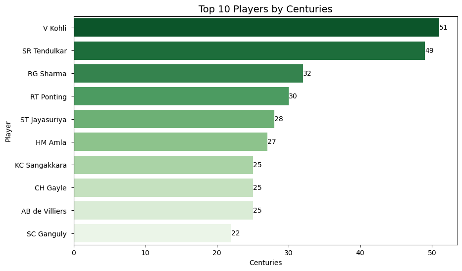
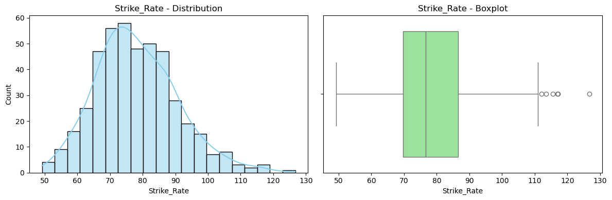
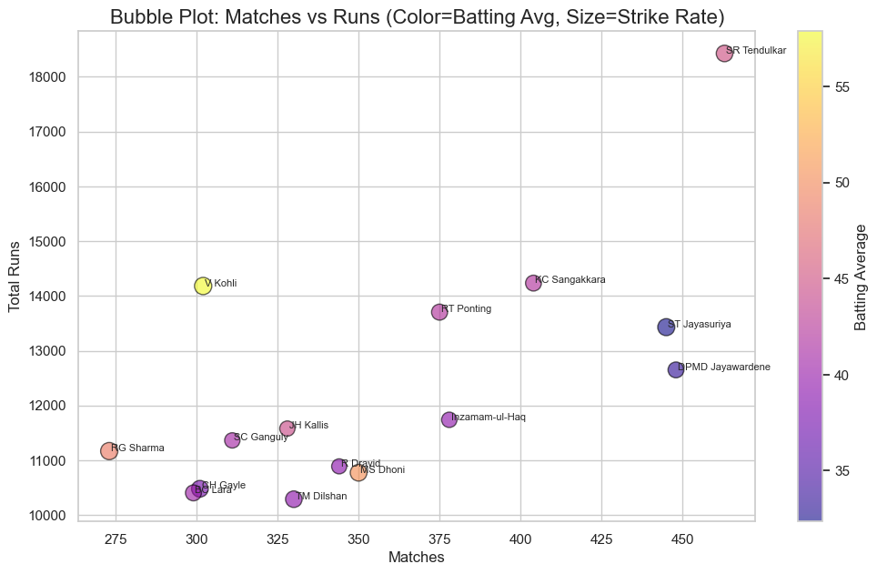

# 🏏 ODI Batting Statistics – Exploratory Data Analysis  

## 📌 Project Overview  
This project is an **Exploratory Data Analysis (EDA)** of ODI (One Day International) batting statistics using **Python, Seaborn, and Matplotlib**.  
It covers **web scraping, data cleaning, and data visualization** to uncover player performance insights and cricketing trends.  

---

## ❓ Problem Statement  
Cricket generates a massive amount of performance data, but raw numbers can be difficult to interpret.  
This project aims to:  
- Identify **top-performing players** based on runs, averages, and strike rates.  
- Compare batting performance across **eras and countries**.  
- Uncover insights into **batting trends and evolution of playing styles**.  

---

## 📂 Dataset  
The dataset was collected via **Web Scraping (BeautifulSoup)**.  
It contains the following columns:  

- Player_Names  
- Country  
- Matches, Innings, Not Outs  
- Total Runs, Highest Score  
- Batting Average  
- Balls Faced  
- Strike Rate  
- 100s (Centuries)  
- 50s (Half-centuries)  

---

## 🛠️ Tools & Technologies  
- **Python** 🐍  
- **Libraries:** Pandas, NumPy, Matplotlib, Seaborn, BeautifulSoup  
- **Jupyter Notebook**  

---

## 🔬 Methods  
1. **Web Scraping** – Extracted ODI batting stats from cricket sites.  
2. **Data Cleaning** – Handled missing values, standardized formats.  
3. **Exploratory Data Analysis** –  
   - *Univariate*: Top run-scorers, country distribution, strike rates.  
   - *Bivariate*: Runs vs Matches, Average vs Strike Rate.  
   - *Multivariate*: Heatmaps & Bubbleplot for batting metrics.  
4. **Visualization** – Created professional plots with Seaborn & Matplotlib.  

---

## 📊 Key Insights  
- 👑 A few **elite players dominate** in runs & centuries, while most fall in the mid-range.  
- ⚡ **Strike rates have significantly improved** in modern cricket.  
- 📈 Matches strongly correlate with total runs, but **batting averages vary** widely.  
- 🌍 Country-wise, some nations consistently produce top-performing batsmen.  

---

## 📸 Sample Visualizations  

Here are some sample outputs from the analysis:  


  

  

  

---
<!--
# ▶️ How to Run this Project  
1. Clone the repository:  
   ```bash
   git clone https://github.com/saurabhks001/odi-batting-eda.git
   cd odi-batting-eda

pip install -r requirements.txt

jupyter notebook Cricket_EDA.ipynb 
-->
---

## ✅ Conclusion  
This project highlights how **data-driven analysis provides deeper insights into cricket**.  

It allows for better **player comparison, trend analysis, and strategy development** in ODI cricket.  

---

## 🚀 Future Scope  
- Extend analysis to **bowling and all-rounders**.  
- Develop **interactive dashboards (Power BI/Tableau)**.  
- Apply **Machine Learning models** to predict player performance.  

---

## 👤 Author  
**Saurabh Shirole**  
📧 Email: saurabhshirole1@gmail.com 

🔗 [LinkedIn](https://www.linkedin.com/in/saurabh-shirole-19136a361/) | [GitHub](https://github.com/saurabhks001)  

